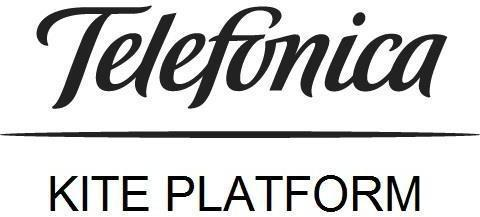
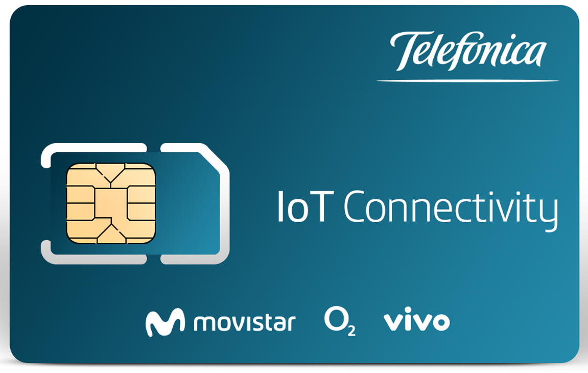
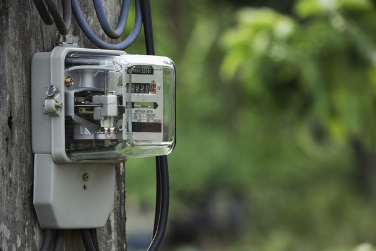

# IoT connectivity: first steps

## About this site

This site gives device and firmware developers an approach of LTE-M and NBIoT and its benefits in comparison with previous Cellular IoT technologies.

## General strategy
To attend requirements for IOT specific use cases, Telefonica has clearly betted to evolve its networks to licensed LPWA technologies, 
it means Telefonica is going to develop NB-IOT, and LTEM.

We include these new technologies as part of our value proposition including our current offer managed connectivity, security, QoS, private networks, etc.
Besides, Telefonica is going to develop end to end solutions; device, connectivity, data management, analytics, 
etc for some specific use cases to try to accelerate implementation of the customer service.

## IoT Technologies 

[Technological background](technological_background.md)

## Managing sims with Kite Platform

    

# LPWAN

<table style="width:90%" align="center">
  <tr>
	<th>
		<a href="#/Mobile_IoT_Developer_Guide.md#functionalities-for-limited-power-consumption" align="center" >
			How to reduce Power Consumption
		</a>
	</th>
	<th>
		
	</th>
	<th>
		<a href="#/Mobile_IoT_Developer_Guide.md#coverage-enhancement" align="center">
			How to enhance coverage
		</a>
	</th>
  </tr>
  <tr>
	<th>
		
	</th>
	<th></th>
	<th>
		
	</th>
  </tr>
  <tr></tr>
  <tr>
	<th>
		<a href="#/Mobile_IoT_Developer_Guide.md#connection-architectures" align="center">
			Connection Plane vs User Plane
		</a>
	</th>
	<th></th>
	<th>
		<a href="#/Mobile_IoT_Developer_Guide.md#communication-protocols-network-protocols" align="center">
			Non IP
		</a>
	</th>
  </tr>
  <tr>
	<th>
		
	</th>
	<th></th>
	<th>
		
	</th>
  </tr>
    <tr></tr>
    <tr>
	<th>
		<a href="#/Mobile_IoT_Developer_Guide.md#remote-euicc-provisioning" align="center">
			Remote eUICC provisioning
		</a>
	</th>
	<th></th>
	<th>
		<a href="#/Mobile_IoT_Developer_Guide.md#telefonica-lpwa-connectivity" align="center">
			TEF LPWA networks details
		</a>
	</th>
  </tr>
  <tr>
	<th>
		
	</th>
	<th></th>
	<th>
		
	</th>
  </tr>
  </tr>
    <tr></tr>
    <tr>
	<th>
		<a href="#/Telefonica_M2M-IoT_Device_Behaviour_Requirements.md" align="center">
			Device Behaviour Requirements
		</a>
	</th>
	<th></th>
	<th>
		<a href="#/Telefonica_How_to_NBIoT.md" align="center">
			Telefonica NB IoT Connectivity
		</a>
	</th>
  </tr>
  <tr>
	<th>
		
	</th>
	<th></th>
	<th>
		
	</th>
  </tr>
</table>

## Recipes

<table>
  <tr>
	<th>
		<a href="#/Mobile_IoT_Developer_Guide_recipes.md#smart-meter-pattern" align="center" >
			Smart meter
		</a>
	</th>
	<th>
		<a href="#/Mobile_IoT_Developer_Guide_recipes.md#always-on-pattern" align="center" >
			Always ON
		</a>
	</th>
  </tr>
	<th>
		
	</th>
	<th>
		
	</th>
  </tr>
  <tr>
	<th>
		<a href="#/Mobile_IoT_Developer_Guide_recipes.md#massive-data-transfer-pattern" align="center" >
			Massive data transfer
		</a>
	</th>
	<th>
		<a href="#/Mobile_IoT_Developer_Guide_recipes.md#movable-devices" align="center" >
			Movable devices
		</a>
	</th>
  </tr>
  	<th>
		
	</th>
	<th>
		
	</th>
  </tr>
</table>

