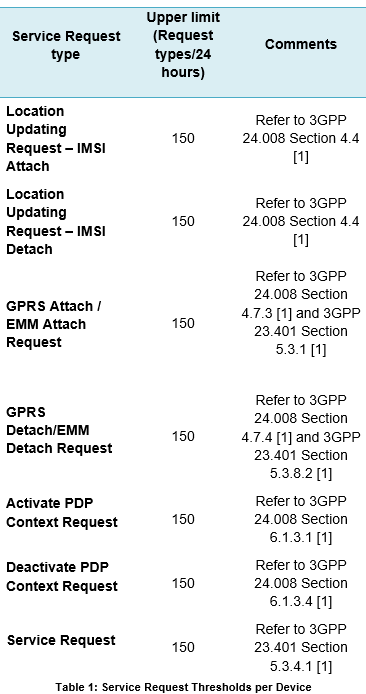
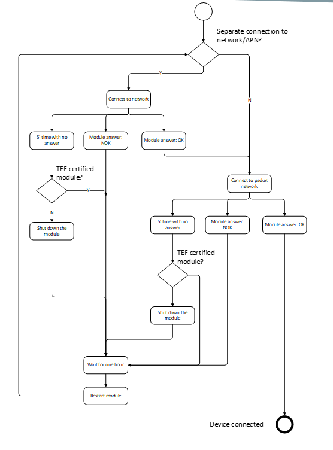

## DOCUMENT REFERENCES
1. [3GPP specifications](www.3gpp.org)

- Including but not restricted to:
  - [3GPP TS 24.008](http://www.3gpp.org/ftp/Specs/html-info/24008.htm)
  - [3GPP TS 23.060](http://www.3gpp.org/ftp/Specs/html-info/23060.htm)
  - [3GPP TS 23 401](http://www.3gpp.org/ftp/Specs/html-info/23401.htm)

2. Embedded Mobile Guidelines, GSMA, www.gsma.org
http://www.gsma.com/connectedliving/sample-page/embedded-mobile-guidelines

3. TS.24 Operator Minimum Acceptance Values for Device Antenna Performance, GSMA, www.gsma.org
http://www.gsma.com/newsroom/official-document-ts-24-operator-minimum-acceptance-values-for-device-antenna-performance

4. Device Implementation Guidelines, SIM Alliance, www.simalliance.org
http://www.simalliance.org/en/resources/recommendations/simalliance-uicc-device-implementation-guidelines_hckkbowk.html?&highlight=1&keys=device+implementation+guidelines&lang=0

5. Telefonica M2M/IoT Device Behaviour Guidelines

6. Telefonica M2M/IoT Device Behaviour Requirements

7. IoT Device Connection Efficiency Guidelines Version 5.0 - 8 January 2018
https://www.gsma.com/newsroom/wp-content/uploads//TEF.IOT.DB_v5.0.pdf

## 1. Introduction
In M2M/IoT scenarios device firmware and software play a significant part in determining the overall performance and behaviour of the service on the mobile network. With no human intervention to fall back on, mechanisms that manage recovery from failure need to be built into software. Poor design of device - network interactions which disregard the network and device status may result in inefficient use of network and device resources, affecting the M2M/IoT experience end-to-end.
Efficient device behaviour can be accomplished following some basic guidelines on network resource management for outstanding performance in M2M/IoT scenarios.

### 1.1 Goal of this document
The purpose of this document is to enable Customers of Telefonica to achieve the best performance from their M2M or IoT Devices providing guidance to manage network resources efficiently.
Following these guidelines, our customers will deliver the best quality M2M/IoT solutions and optimize the performance of all the elements part of the solution: SIM card, device, network and service.

### 1.2 Requirements origin and type
These requirements are based but not restricted to relevant 3GPP specifications and GSMA and SIM Alliances best practices. On top of them
Along the document some Requirements will be marked as Recommendations and some others as Mandatory. 
Mandatory requirements will be tested along Telefónica Device Onboarding Process. Devices fulfilling all Mandatory Requirements will pass successfully said process.

### 1.3 Document content
Sections 2 and 3 describe Telefonica requirements [6] and additional best practices to achieve an efficient use of network resources.
In many cases developers will use IoT/M2M modules. Modules encapsulate many details of network connection.
But in some cases they don’t give to the developer the information needed to fulfill the previous requirements.
Section 4 gives some simple advices to fulfill Telefónica requirements when using a module
Annex A describes in detail how Telefónica and 3GPP requirements apply to each error response from the network.
This document is assuming expertise in the basic concepts of mobile network communication.
Please refer to [1] for further information on mobile network architecture and communication procedures.

### 1.4 Definition of Terms 
- **ADM** Access condition to an Elementary File (EF) which is under the control of the authority which creates this file
- **Back-off Timer** The Back-off Timer is a dynamic timer which value is based on a unique value for the device (desirably the IMSI) and the number of consecutive failures (which points to different Back-off Base Intervals).
- **Communications Module** The communications component which provides wide area (2G, 3G, 4G) radio connectivity. Comprising of Communications Module Firmware, Radio Baseband Chipset and UICC
- **Communications Module Firmware** The functionality within the Communications Module that provides an API to the IoT Device Application and controls the Radio Baseband Chipset.
- **End Customer** Means the consumer of IoT Services provided by the IoT Service Provider. It is feasible that the End Customer and IoT Service Provider could be the same actor, for example a utility company.
- **Fast Dormancy** Device power saving mechanism. See GSMA TS.18 [14].
- **Global Certification Forum** An independent worldwide certification scheme for mobile phones and wireless devices that are based on 3GPP standards. The GCF provides the framework within which cellular GSM, UMTS and LTE mobile devices and Communication Modules obtain certification for use on GCF Mobile Network Operators’ networks. Obtaining GCF Certification on a mobile device ensures compliance with 3GPP network standards within the GCF Mobile Network Operators' networks. Consequently, GCF Mobile Network Operators may block devices from their network if they are not GCF certified. For more information, see http://www.globalcertificationforum.org 
- **Internet of Things** The Internet of Things describes the coordination of multiple machines, devices and appliances connected to the Internet through multiple networks. These devices include everyday objects such as tablets and consumer electronics, and other machines such as vehicles, monitors and sensors equipped with machine-to-machine (M2M) communications that allow them to send and receive data.
- **IoT Device** The combination of both the IoT Device Application and the Communications Module.
- **IoT Device Application** The application software component of the IoT Device that controls the Communications Module and interacts with an IoT Service Platform via the Communications Module.
- **IoT Device Host** The application specific environment containing the IoT Device e.g. vehicle, utility meter, security alarm etc.
- **IoT Server Application** An application software component that runs on a server and can exchange data and interact with the IoT Devices and the IoT Device Applications over the IoT Service Platform.
- **IoT Service** The IoT service provided by the IoT Service Provider.
- **IoT Service Platform** The service platform, hosted by the IoT Service Provider which communicates to an IoT Device to provide an IoT Service. The IoT Service Platform can exchange data with the IoT Device Application over the Mobile Network and through the Communication Module, using (among others) IP-based protocols over a packet-switched data channel. Also, the IoT Service Platform typically offers Device Management capabilities, acting as a so-called Device Management Server. Finally, the IoT Service Platform typically offers APIs for IoT Server Applications to exchange data and interact with the IoT Device Applications over the IoT Service Platform.
- **IoT Service Provider** The provider of IoT services working in partnership with a Mobile Network Operator to provide an IoT Service to an End Customer. The provider could also be a Mobile Network Operator.
- **Machine to Machine** Machine-to-Machine (M2M) is an integral part of the Internet of Things (IoT) and describes the use of applications that are enabled by the communication between two or more machines. M2M technology connects machines, devices and appliances together wirelessly via a variety of communications channels, including IP and SMS, to deliver services with limited direct human intervention turning these devices into intelligent assets that open up a range of possibilities for improving how businesses are run.
- **Mobile Network Operator** The mobile network operator(s) connecting the IoT Device Application to the IoT Service Platform.
- **PTCRB** The independent body established as the wireless device certification forum by North American Mobile Network Operators. The PTCRB provides the framework within which cellular GSM, UMTS and LTE mobile devices and Communication Modules obtain certification for use on PTCRB Mobile Network Operator networks. Obtaining PTCRB Certification on a mobile device ensures compliance with 3GPP network standards within the PTCRB Mobile Network Operators' networks. Consequently, PTCRB Mobile Network Operators may block devices from their network if they are not PTCRB certified. For more information, see http://ptcrb.com 
- **Radio Baseband Chipset** The functionality within the Communications Module that provides connectivity to the mobile network.
- **Requirements numbering: TS34_X.X_REQ_YYY** 
    - **TS.34** = this PRD number.
    - **X.X** = the section number the requirement can be found in.
    - **REQ** = Requirement
    - **YYY** = the requirement number.
- **Subscriber Identity Module** Module provided by the Mobile Network Operator containing the International Mobile Subscriber Identity (IMSI) and the security parameters used to authenticate the (U)SIM with the Network. Seen as an authentication application contained in the Universal Integrated Circuit Card (UICC).
- **UICC** The smart card used by a mobile network to authenticate devices for connection to the mobile network and access to network services.

### 1.5 Abbreviations
- **3GPP** 3rd Generation Project Partnership
- **API** Application Programming Interface
- **APN** Access Point Name
- **GCF** Global Certification Forum
- **GSM** Global System Mobile
- **GSMA** GSM Association 
- **IMEI** International Mobile station Equipment Identity
- **IMSI** International Mobile Subscriber Identity
- **IoT** Internet of Things
- **IP** Internet Protocol
- **LTE** Long Term Evolution
- **M2M** Machine to Machine
- **NAT** Network Address Translation
- **NFM** Network Friendly Mode – see section ¡Error! No se encuentra el origen de la referencia.
- **OTA** Over The Air
- **PDP** Packet Data Protocol
- **PTCRB** A pseudo-acronym, originally meaning PCS Type Certification Review Board, but no longer applicable.
- **RFC** Request for Comments – a document of the Internet Engineering Task Force
- **RPM** Radio Policy Manager – see section ¡Error! No se encuentra el origen de la referencia.
- **RRC** Radio Resource Control
- **SMS** Short Message Service
- **UMTS** Universal Mobile Telecommunications Service
- **(U)SIM** (Universal) Subscriber Identity Module
- **USB** Universal Serial Bus

### 1.6 References
1. **3GPP Specifications** www.3gpp.org 

2. **RFC 2119** Key words for use in RFCs to Indicate Requirement Levels
http://www.ietf.org/rfc/rfc2119.txt 

3. **3GPP TS 36.331** Evolved Universal Terrestrial Radio Access (E-UTRA); Radio Resource Control (RRC); Protocol specification
www.3gpp.org

4. **3GPP TS 31.102** Characteristics of the Universal Subscriber Identity Module (USIM) application
www.3gpp.org

5. **GSMA SGP.02** Remote Provisioning Architecture for Embedded UICC Technical Specification
www.gsma.com 

6. **3GPP TS 22.016** International Mobile station Equipment Identities (IMEI)
www.3gpp.org

7. **OMA DiagMon** OMA DiagMon Management Object Version 1.2
www.openmobilealliance.org 

8. **OMA DM** OMA Device Management Version 1.2 or 1.3
www.openmobilealliance.org

9. **OMA FUMO** OMTA Firmware Update Management Object Version X.X
www.openmobilealliance.org

10. **GSMA TS.06** IMEI Allocation and Approval Process
www.gsma.com 

11. **OMA ERELDDM_1.2** Enabler Release Definition for OMA Device Management
www.openmobilealliance.org

12. **3GPP TS 24.008** Mobile radio interface Layer 3 specification; Core network protocols; Stage 3
www.3gpp.org

13. **3GPP TS 23.122** Non-Access-Stratus functions related to Mobile Station in idle mode
www.3gpp.org

14. **GSMA TS.18** Fast Dormancy Best Practices
www.gsma.com 

15. **OMA LightweightM2M** OMA LightweightM2M
www.openmobilealliance.org

16. **GSMA IR.92** IMS Profile for Voice and SMS

17. **TDDC** Telefónica Device Design Council M2M Devices Requirements and Tests.

18. **CTIA (The Wireless Association)** CTIA Cybersecurity Certification Test Plan  for IoT Devices

## 2. GSMA TS.34 IoT Device Connection Efficiency Guidelines

Telefónica refers device developers to “GSMA TS.34 IoT Device Connection Efficiency Guidelines Version 5.0”. 
The following table refers, for each chapter of the document, the status of its requirements for Telefónica

| Chapter | Title | Status for Telefónica |
|:------ | ----- | ----- |
| 1 | Introduction | Informative |
| 2 | IoT Architecture Assumptions | Informative |
| 3 | IoT Device Requirements | Recommendations |
| 4 | IoT Device Application Requirements | Recommendations |
| 5 | Communication Module Requirements | Recommendations |
| 6 | IoT Service Provider Requirements | Recommendations |
| 7 | Connection Efficiency Requirements | Recommendations |
| 8 | Radio Policy Manager Requirements | Recommendations |
| 9 | 3GPP Connection Efficiency Features | Obligatory |

## 3. IoT Device. Specific Telefónica Requirements (Mandatory Section)

Beyond the recommendations and requirements included in GSMA TS.34, Telefónica adds the following requirements 
that have to be followed by Telefónica certified devices:

- **TEF.IOT.DB_4.3_REQ_001 (Mandatory)**
The Customer shall use a Communications Module in the Device which is fully compliant with the 3GPP specifications

- **TEF.IOT.DB_4.3_REQ_002 (Mandatory)**
IoT Devices sold or operated by Telefónica will follow the standards described in Telefónica Device Design Council (TDDC) latest release. 

- **TEF.IOT.DB_4.3_REQ_003 (Mandatory)**
The Customer shall use a Communications Module or a Device which has passed a test programme certified by the GCF and/or the PTCRB.

- **TEF.IOT.DB_4.3_REQ_004 (Mandatory)**
The IoT Device shall correctly observe the cause codes sent in reject messages from the network in response to service requests sent from the IoT Device. If the network denies a service request with a reject message the IoT Device Application shall assess the reject cause code and, if appropriate, a retry may be attempted.

- **TEF.IOT.DB_4.3_REQ_008 (Recommendation)**
Devices shall minimize reattempted Service Requests using time-spaced, randomised and exponentially delayed retry schemas. 
The Service Request retries shall be no more frequent than once every 1 minute and no more than 10 times in an hour.
  - An example of a valid schema would be: 
    - Initial attempt: To.
    - Reattempts Time: To+(1±random) minutes, To+(2±random)  minutes, To+(3±random) minutes, To+(5±random)  minutes, To+(10±random), To+(15±random) minutes,   To+(30±random)  minutes, To+(1±random)  hour, To+(2±random)  hours, To+(4±random)  hours, …

- **TEF.IOT.DB_4.3_REQ_009 (Mandatory)**
In the cases where 3GPP standards specify that the device shall SIM/USIM invalid for GPRS/EPS or non-GPRS/EPS services until switch off or SIM/USIM is removed or store the PLMN in the FPLMN list, when applicable, the device shall reboot the communications moduleThe time between reboots shall not be more frequent than once every 1 hour. 

This Requirement applies to the following Reject Causes:
  - Location Updating:
    - #11 PLMN not allowed (in VPLMN)
    - #14 GPRS services not allowed in this PLMN

  - GPRS Attach and Combined Attach:
    - #7 GPRS/EPS Service Not Allowed
    - #11 PLMN not allowed (in VPLMN)
    - #14 GPRS services not allowed in this PLMN

  - GPRS Detach initiated by network:
    - #7 GPRS/EPS Service Not Allowed
    - #11 PLMN not allowed (in VPLMN)
    - #14 GPRS services not allowed in this PLMN

  - Routing area update:
    - #7 GPRS/EPS Service Not Allowed
    - #11 PLMN not allowed (in VPLMN)
    - #14 GPRS services not allowed in this PLMN

  - Service Request:
    - #7 GPRS/EPS Service Not Allowed
    - #11 PLMN not allowed (in VPLMN)
    - #30 Activation rejected by GGSN, Serving GW or PDN GW

- **TEF.IOT.DB_4.3_REQ_009 (Recommendation)**
In the cases where 3GPP standards specify that the device shall register the PLMN in the FPLMN list, the time between reboots shall be randomised and exponentially growing.
  - For example: 
    - Initial attempt: To.
    - Reattempts Retry Time: To+(1±random) hours, To+(4±random) hours To+(8±random) , To+(16±random)  hours , To+(24±random), To+(36±random),   To+(48±random), To+(72±random)  and To+(96±random), To+(132±random), To+(180±random), To+(240±random), To+(312±random) hours,….

- **TEF.IOT.DB_4.3_REQ_010 (Recommendation)**
The devices Application shall avoid rapid and repeated power cycle resets of the M2M/IoT Device

- **TEF.IOT.DB_4.3_REQ_011 (Mandatory)**
Devices shall not exceed the quantity of Service Requests set out in Table 1

- **TEF.IOT.DB_4.3_REQ_012 (Recommendation)**
If permissible for the IoT Service, the IoT Device Application should avoid synchronized behaviour with other IoT Devices and employ a randomized pattern (e.g. over a period of time of a few seconds to several hours or days) for network connection requests.

- **TEF.IOT.DB_4.3_REQ_013 (Recommendation)**
Customer’s Business Applications, accessing multiple Devices, shall avoid synchronised behaviour and employ a randomised pattern for accessing the Devices in the Customer’s Device estate.

- **TEF.IOT.DB_4.3_REQ_014 (Recommendation)**
If the (U)SIM subscription associated with an IoT Device is to be placed in a temporarily inactive state (i.e. the subscription is to be disabled for a fixed period of time), the IoT Service Provider shall first ensure that the IoT Device is temporarily disabled to restrict the device from trying to register to the network once the SIM is disabled.
Before the (U)SIM subscription associated with an IoT Device is changed to a permanently terminated state, the IoT Service Provider shall ensure that the IoT Device is permanently disabled to stop the device from trying to register to the network once the SIM is permanently disabled.

- **TEF.IOT.DB_4.3_REQ_015 (Mandatory)**
Whilst attached to a Network, the Device shall remain attached to the selected Network and shall not trigger a network search to select a different Network except where due to a valid cause, e.g. loss of radio coverage, or searching for a prioritized technology. The network search shall follow the network selection algorithm, as defined by 3GPP specifications

- **TEF.IOT.DB_4.3_REQ_016 (Mandatory)**
The first Attach of a device in a new network can take longer than the regular connection. The application should close the connection when the network gives an error code, instead of using a timer. If a timer has to be used it shouldn’t be smaller than five minutes.

## 4. Security 

- **TEF.IOT.DB_4.3_REQ_017 (Recommendation)**
The device should pass the CTIA Cybersecurity Certification Test Plan  for IoT Devices, assuring it’s integral security.

## 5.	A practical guide to fulfill Telefónica requirements using a module

### 5.1	Addressed situation
The Telefónica Guidelines and Requirements give rules that have to be fulfilled by the device as a whole. But in most B2B cases the manufacturers will use a communications module. The communications module manages communications setup automatically. Firmware developers can sometimes force or interrupt actions but in a limited fashion.

Telefónica Guidelines and Requirements assume that firmware developers can take specific actions depending on the error reported by the network. But this is not usually the case. Module information is very variable. In best cases transient (error ID can only be read for a few seconds). In many other cases error causes are hidden from developers.

Even if information is fully available, firmware code dealing separately with each error cause would be difficult to write, complex and error prone. 

### 5.2	Guidelines
Use a module certified by Telefónica. If it is not possible, at the very least it should be GCF/PTCRB certified. But modules not certified by Telefónica may fail to follow some reconnection policy requirements.

#### 5.2.1	If you are using a module certified by Telefónica
- Activate RPM in the module, if it can be done through a command. For example in some commercial modules is done through the command:
`AT+NCONFIG=RPM,TRUE`

- Let the module connect automatically. Do not force a PLMN. 
__You may do this simply switching on the module, switching on the radio (AT+CFUN=0), forcing the radio connection (AT+COPS=0) or attaching to the APN (AT+CGDCPNT)__

- If possible, let the module attach to the default APN configured in the connectivity management system. That way you will not have errors due to wrong APNs, and you will not have to “burn” the APN in the device firmware.

- If the module has not connected in one hour, reboot it completely. Shut it down and restart it. Relaunch the connection sequence.

- If, before one hour passes, the module gives an error message and stops trying to connect, do not launch a new connection attempt. Wait until an hour has passed from the beginning of the connection and reboot the module.

- It is desirable not to reboot exactly after 3600 seconds, but to allow some random variability to avoid multiple simultaneous connections to the network and your servers.

- In some cases you may not want to wait for one hour with the module probing the network. You may prefer to shut down the module and wait for an hour and reboot or simply quit until other day or reporting situation arises. In that case let the module connect for at least five minutes, as this is the maximum time a connection may take in some roaming situations.

- If you connect to the network but cannot manage to connect to your server, do not force a reconnection. Either:
  - Retry on the existing mobile connection, remembering that the network will bill every sent IP packet, even if you get no answers.
  - Reset the mobile connection after one hour. Rebooting the module may be useful if the problem is in it. 

#### 5.2.2	If you are not using a module certified by Telefónica
If your module is not certified by Telefónica you may still follow the above but:

- If the module gives you an error message, failing to connect to the radio network or the APN, or if five minutes pass without an answer from the module when trying to connect: switch off the module and wait for one hour to try again.

## Annex A	GSM/UMTS Cause Code 

- #2 IMSI unknown in HLR/HSS
  - **Message:** LOCATION UPDATING REJECT
  - **Technology:** 2G/3G
  - **Network:** HPLMN/VPLMN
  - **Expected Result:**
According to 3GPP  TS 24.008 (2G/3G) after receiving a  LOCATION UPDATING REJECT  with cause #2 (IMSI unknown in HLR/HSS):
    - The DuT shall consider the SIM/USIM invalid for non-GPRS services until a reboot occurs. 
The DuT could keep connected to GPRS services.

In addition to 3GPP standards, Telefonica requirements and guidelines also have to be followed:
    - Reboots are required to recover the full connectivity of the DuT (CS+PS) and shall not be more frequent than once every 1 hour. It is recommend to follow a randomised and exponential delayed on time reboot scheme based on hours

- #7 GPRS/EPS Service Not Allowed
  - **Message:** DETACH REQUEST FROM THE NETWORK
  - **Technology:** 4G
  - **Network:** VPLMN
  - **Expected Result:**
  According to 3GPP  TS 24.008 (2G/3G) and TS 24.301 (LTE) after receiving a DETACH REQUEST FROM THE NETWORK with cause #7 (EPS services not allowed) in VPLMN: 
    - The DuT shall consider SIM/USIM invalid for EPS services, shall retry once to register in CS selecting the 2G/3G available network and NO ATTACH REQUEST or TRACKING AREA UPDATE REQUEST or SERVICE REQUEST shall be done until a reboot occurs.
The DuT can keep attached to CS services. 

In addition to 3GPP standards, Telefonica requirements and guidelines also have to be followed:
    - Reboots are required to recover the full connectivity of the DuT (CS+PS) and shall not be more frequent than once every 1 hour. It is recommend to follow a randomised and exponential delayed on time reboot scheme based on hours.

- #7 GPRS/EPS Service Not Allowed
  - **Message:** ATTACH REJECT
  - **Technology:** 2G/3G
  - **Network:** VPLMN
  - **Expected Result:** 
According to 3GPP TS 24.008 (2G/3G)  after receiving a ATTACH REJECT with cause #7 (GPRS services not allowed) in VPLMN:
    - The DuT shall consider SIM/USIM invalid for GPRS services and NO ATTACH REQUEST or ROUTING AREA UPDATE REQUEST shall be done until a reboot occurs.
The DuT can keep attached to CS services. 

In addition to 3GPP standards, Telefonica requirements and guidelines also have to be followed:
    - Reboots are required to recover the full connectivity of the DuT (CS+PS) and shall not be more frequent than once every 1 hour. It is recommend to follow a randomised and exponential delayed on time reboot scheme based on hours.

- #8 Operator Determined Barring
  - **Message:** DEACTIVATE  PDP CONTEXT REQUEST
  - **Technology:** 2G/3G
  - **Network:** HPLMN/VPLMN
  - **Expected Result:**
According to 3GPP TS 24.008 (2G/3G) after receiving a DEACTIVATE PDP CONTEXT REQUEST message with cause #8  (Operator determined barring):
    - The DuT shall deactivate the PDP context and send a DETACH ACCEPT message to the network.

In addition to 3GPP standards, Telefonica requirements and guidelines also have to be followed:
    - Reboots are required to recover the full connectivity of the DuT (CS+PS) and shall not be more frequent than once every 1 hour. It is recommend to follow a randomised and exponential delayed on time reboot scheme based on hours.

- #10 Implicitly detached
  - **Message:** DETACH REQUEST FROM THE NETWORK
  - **Technology:** 4G
  - **Network:** HPLMN/VPLMN
  - **Expected Result:**
According to 3GPP TS 24.008 (2G/3G) and TS 24.301 (LTE) after receiving a DETACH REQUEST FROM THE NETWORK  with cause #10 (Implicitily detached):
    - The DuT shall retry once a new attach procedure and reactivate the previous PDP context or PDN connectivity.

- #10 Implicitly detached
  - **Message:** SERVICE REJECT
  - **Technology:** 4G
  - **Network:** HPLMN/VPLMN
  - **Expected Result:**
According to 3GPP TS 24.008 (2G/3G) and TS 24.301 (LTE) after receiving a SERVICE REJECT with cause #10 (Implicitily detached):
    - The DuT shall retry once a new attach procedure and reactivate the previous PDP context or PDN connectivity.

- #10 Implicitly detached
  - **Message:** SMS CP Data with RP Error cause #10 ( "Implicitly detached") 
  - **Technology:** 
  - **Network:** HPLMN/VPLMN
  - **Expected Result:**

- #11 PLMN not allowed
  - **Message:** ATTACH REJECT
  - **Technology:** 2G/3G
  - **Network:** HPLMN
  - **Expected Result:**
According to 3GPP  TS 24.008 (2G/3G) after receiving an ATTACH REJECT with cause #11 (PLMN not allowed) in the HPLMN
    - The DuT shall search for a suitable cell in another location area or tracking area.

In addition to 3GPP standards, Telefonica requirements and guidelines also have to be followed:
    - LOCATION UPDATING REQUEST or  ATTACH REQUEST or ROUTING AREA UPDATE REQUEST or TRACKING AREA UPDATE REQUEST retries shall not be more frequent than once every 1 minute and no more than 10 in 1 hour. It is recommended to follow a randomised and exponential delayed on time retry scheme based on minutes.
    - After 1 hour of retries, it is strongly recommended to reboot the module using a randomised and exponential delayed on time reboot scheme based on hours (instead of one based on minutes). Reboots shall not be more frequent than once every 1 hour.

According to 3GPP TS 23.122:
    - The HPLMN (if the EHPLMN list is not present or is empty) or an EHPLMN (if the EHPLMN list is present) shall not be stored on the list of "forbidden PLMNs for GPRS service".

- #11 PLMN not allowed
  - **Message:** ATTACH REJECT
  - **Technology:** 2G/3G
  - **Network:** VPLMN
  - **Expected Result:**
According to 3GPP TS 24.008 (2G/3G) after receiving an  ATTACH REJECT with cause #11 (PLMN not allowed) in the VPLMN:
    - The DuT shall store the current PLMN in list of "forbidden PLMN list" and NO LOCATION UPDATING REQUEST or  ATTACH REQUEST or ROUTING AREA UPDATE REQUEST or TRACKING AREA UPDATE REQUEST  shall be done in the same PLMN until a reboot occurs.
    - The DuT shall perform a new PLMN selection.

In addition to 3GPP standards, Telefonica requirements and guidelines also have to be followed:
    - Reboots are required to recover the full connectivity of the DuT, if PLMN selection had not had success.
    - Reboots shall not be more frequent than once every 1 hour. It is recommend to follow a randomised and exponential delayed on time reboot scheme based on hours

- #11 PLMN not allowed
  - **Message:** SERVICE REJECT
  - **Technology:** 4G
  - **Network:** HPLMN
  - **Expected Result:**
According to 3GPP  TS 24.008 (2G/3G)  and TS 24.301 (LTE) after receiving an SERVICE REJECT with cause #11 (PLMN not allowed) in the HPLMN
    - The DuT shall search for a suitable cell in another location area or tracking area.

In addition to 3GPP standards, Telefonica requirements and guidelines also have to be followed:
    - LOCATION UPDATING REQUEST or  ATTACH REQUEST or ROUTING AREA UPDATE REQUEST or TRACKING AREA UPDATE REQUEST retries shall not be more frequent than once every 1 minute and no more than 10 in 1 hour. It is recommended to follow a randomised and exponential delayed on time retry scheme based on minutes.
    - After 1 hour of retries, it is strongly recommended to reboot the module using a randomised and exponential delayed on time reboot scheme based on hours (instead of one based on minutes). Reboots shall not be more frequent than once every 1 hour.

According to 3GPP TS 23.122:
    - The HPLMN (if the EHPLMN list is not present or is empty) or an EHPLMN (if the EHPLMN list is present) shall not be stored on the list of "forbidden PLMNs for GPRS service".

- #11 PLMN not allowed
  - **Message:** SERVICE REJECT
  - **Technology:** 4G
  - **Network:** VPLMN
  - **Expected Result:**
According to 3GPP TS 24.008 (2G/3G) and TS 24.301 (LTE)  after receiving an SERVICE REJECT with cause #11 (PLMN not allowed) in the VPLMN:
    - The DuT shall store the current PLMN in list of "forbidden PLMN list" and NO LOCATION UPDATING REQUEST or  ATTACH REQUEST or ROUTING AREA UPDATE REQUEST or TRACKING AREA UPDATE REQUEST  shall be done in the same PLMN until a reboot occurs.
    - The DuT shall perform a new PLMN selection.

In addition to 3GPP standards, Telefonica requirements and guidelines also have to be followed:
    - Reboots are required to recover the full connectivity of the DuT, if PLMN selection had not had success.
    - Reboots shall not be more frequent than once every 1 hour. It is recommend to follow a randomised and exponential delayed on time reboot scheme based on hours.

- #14 GPRS services not allowed in this PLMN
  - **Message:** ATTACH REJECT
  - **Technology:** 2G/3G
  - **Network:** HPLMN
  - **Expected Result:**
According to 3GPP TS 24.008 (2G/3G) after receiving ATTACH REJECT with cause #14 (GPRS services not allowed in this PLMN) in the HPLMN:
    - The DuT shall not send any ATTACH REQUEST or ROUTING AREA UPDATE REQUEST or TRACKING AREA UPDATE REQUEST in the same PLMN until a reboot occurs.
    - The DuT shall perform a new PLMN selection.

In addition to 3GPP standards, Telefonica requirements and guidelines also have to be followed:
    - Reboots are required to recover the full connectivity of the DuT, if PLMN selection had not had success.
    - Reboots shall not be more frequent than once every 1 hour. It is recommend to follow a randomised and exponential delayed on time reboot scheme based on hours.

According to 3GPP TS 23.122:
    - The HPLMN (if the EHPLMN list is not present or is empty) or an EHPLMN (if the EHPLMN list is present) shall not be stored on the list of "forbidden PLMNs for GPRS service".

- #14 GPRS services not allowed in this PLMN
  - **Message:** ATTACH REJECT
  - **Technology:** 2G/3G
  - **Network:** VPLMN
  - **Expected Result:**
According to 3GPP TS 24.008 (2G/3G) after receiving an ATTACH REJECT with cause #14 (GPRS services not allowed in this PLMN) in the VPLMN:
    - The DuT shall store the current PLMN in list of "forbidden PLMNs for GPRS service" and NO ATTACH REQUEST or ROUTING AREA UPDATE REQUEST or TRACKING AREA UPDATE REQUEST shall be done in the same PLMN until a reboot occurs.
    - The DuT shall perform a new PLMN selection.

In addition to 3GPP standards, Telefonica requirements and guidelines also have to be followed:
    - Reboots are required to recover the full connectivity of the DuT, if PLMN selection had not had success.
    - Reboots shall not be more frequent than once every 1 hour. It is recommend to follow a randomised and exponential delayed on time reboot scheme based on hours.

- #14 GPRS services not allowed in this PLMN
  - **Message:** SERVICE REJECT
  - **Technology:** 4G
  - **Network:** HPLMN
  - **Expected Result:**
According to 3GPP TS 24.008 (2G/3G) and TS 24.301 (LTE)  after receiving an SERVICE REJECT with cause #14 (GPRS services not allowed in this PLMN) in the HPLMN:
    - The DuT shall not send any ATTACH REQUEST or ROUTING AREA UPDATE REQUEST or TRACKING AREA UPDATE REQUEST  in the same PLMN until a reboot occurs.
    - The DuT shall perform a new PLMN selection.

In addition to 3GPP standards, Telefonica requirements and guidelines also have to be followed:
    - Reboots are required to recover the full connectivity of the DuT, if PLMN selection had not had success.
    - Reboots shall not be more frequent than once every 1 hour. It is recommend to follow a randomised and exponential delayed on time reboot scheme based on hours.

According to 3GPP TS 23.122:
    - The HPLMN (if the EHPLMN list is not present or is empty) or an EHPLMN (if the EHPLMN list is present) shall not be stored on the list of "forbidden PLMNs for GPRS service".

- #14 GPRS services not allowed in this PLMN
  - **Message:** SERVICE REJECT
  - **Technology:** 4G
  - **Network:** VPLMN
  - **Expected Result:**
According to 3GPP TS 24.008 (2G/3G) and TS 24.301 (LTE)  after receiving an SERVICE REJECT with cause #14 (GPRS services not allowed in this PLMN) in the VPLMN:
    - The DuT shall store the current PLMN in list of "forbidden PLMNs for GPRS service" and NO ATTACH REQUEST or ROUTING AREA UPDATE REQUEST or TRACKING AREA UPDATE REQUEST shall be done in the same PLMN until a reboot occurs.
    - The DuT shall perform a new PLMN selection.

In addition to 3GPP standards, Telefonica requirements and guidelines also have to be followed:
    - Reboots are required to recover the full connectivity of the DuT, if PLMN selection had not had success.
    - Reboots shall not be more frequent than once every 1 hour. It is recommend to follow a randomised and exponential delayed on time reboot scheme based on hours.

[] #15 No Suitable Cells In Tracking/Location Area
  - **Message:** ATTACH REJECT
  - **Technology:** 4G
  - **Network:** HPLMN
  - **Expected Result:**
According to 3GPP TS 24.008 (2G/3G) and TS 24.301 (LTE) after receiving an ATTACH REJECT with cause #15 (No Suitable Cells In Location Area) in the HPLMN
    - The DuT shall search for a suitable cell in another location area or tracking area.

    - If the DuT is in NB-S1 mode and the Extended EMM cause IE with value "NB-IoT not allowed" is included in the TRACKING AREA UPDATE REJECT message, then the DuT may disable the NB-IoT capability and search for a suitable cell in E-UTRAN radio access technology.

In addition to 3GPP standards, Telefonica requirements and guidelines also have to be followed:
    - LOCATION UPDATING REQUEST or  ATTACH REQUEST or ROUTING AREA UPDATE REQUEST or TRACKING AREA UPDATE REQUEST retries shall not be more frequent than once every 1 minute and no more than 10 in 1 hour. It is recommended to follow a randomised and exponential delayed on time retry scheme based on minutes.
    - After 1 hour of retries, it is strongly recommended to reboot the module using a randomised and exponential delayed on time reboot scheme based on hours (instead of one based on minutes). Reboots shall not be more frequent than once every 1 hour.

According to 3GPP TS 23.122:
    - The HPLMN (if the EHPLMN list is not present or is empty) or an EHPLMN (if the EHPLMN list is present) shall not be stored on the list of "forbidden PLMNs for GPRS service".

- #15 No Suitable Cells In Location Area
  - **Message:** SERVICE REJECT
  - **Technology:** 2G/3G/4G
  - **Network:** HPLMN
  - **Expected Result:**
According to 3GPP TS 24.008 (2G/3G) and TS 24.301 (LTE) after receiving an SERVICE REJECT with cause #15 (No Suitable Cells In Location Area) in the HPLMN
    - The DuT shall search for a suitable cell in another location area or tracking area.

    - If the DuT is in NB-S1 mode and the Extended EMM cause IE with value "NB-IoT not allowed" is included in the TRACKING AREA UPDATE REJECT message, then the DuT may disable the NB-IoT capability and search for a suitable cell in E-UTRAN radio access technology.

In addition to 3GPP standards, Telefonica requirements and guidelines also have to be followed:
    - LOCATION UPDATING REQUEST or  ATTACH REQUEST or ROUTING AREA UPDATE REQUEST or TRACKING AREA UPDATE REQUEST retries shall not be more frequent than once every 1 minute and no more than 10 in 1 hour. It is recommended to follow a randomised and exponential delayed on time retry scheme based on minutes.
    - After 1 hour of retries, it is strongly recommended to reboot the module using a randomised and exponential delayed on time reboot scheme based on hours (instead of one based on minutes). Reboots shall not be more frequent than once every 1 hour.

According to 3GPP TS 23.122:
    - The HPLMN (if the EHPLMN list is not present or is empty) or an EHPLMN (if the EHPLMN list is present) shall not be stored on the list of "forbidden PLMNs for GPRS service".

- #15 No Suitable Cells In Location Area
  - **Message:** SERVICE REJECT
  - **Technology:** 2G/3G/4G
  - **Network:** VPLMN
  - **Expected Result:**
According to 3GPP TS 24.008 (2G/3G) and TS 24.301 (LTE) after receiving an SERVICE REJECT with cause #15 (No Suitable Cells In Location Area) in the HPLMN
    - The DuT shall store the current LAI in list of "forbidden location areas for roaming" and shall search for a suitable cell in another location area or tracking area.

    - If the DuT is in NB-S1 mode and the Extended EMM cause IE with value "NB-IoT not allowed" is included in the TRACKING AREA UPDATE REJECT message, then the DuT may disable the NB-IoT capability and search for a suitable cell in E-UTRAN radio access technology.

In addition to 3GPP standards, Telefonica requirements and guidelines also have to be followed:
    - LOCATION UPDATING REQUEST or  ATTACH REQUEST or ROUTING AREA UPDATE REQUEST or TRACKING AREA UPDATE REQUEST retries shall not be more frequent than once every 1 minute and no more than 10 in 1 hour. It is recommended to follow a randomised and exponential delayed on time retry scheme based on minutes.
    - After 1 hour of retries, it is strongly recommended to reboot the module using a randomised and exponential delayed on time reboot scheme based on hours (instead of one based on minutes). Reboots shall not be more frequent than once every 1 hour.

According to 3GPP TS 23.122:
    - The HPLMN (if the EHPLMN list is not present or is empty) or an EHPLMN (if the EHPLMN list is present) shall not be stored on the list of "forbidden PLMNs for GPRS service".

- #17 Network failure
  - **Message:** LOCATION UPDATING REJECT
  - **Technology:** 2G/3G
  - **Network:** HPLMN/VPLMN
  - **Expected Result:**
Steering of Roaming (SoR) is a standardized  procedure used by Telefonica to establich the preferred roaming partners over others.
According to 3GPP  TS 24.008 (2G/3G) when Steering of Roaming is applied after receiving a LOCATION UPDATE REJECT with  cause #17 (Network Failure):
    - The DuT shall retry the LOCATION UPDATE REQUEST at least 4 times at expiring timer T3211 or T3311 or T3411.
    - After the DuT has received the fifth rejection with cause #17 (Network Failure), the DuT shall start a new PLMN search. The device shall not extend the PLMN selection by fallback to CS.

In addition to 3GPP standards, Telefonica requirements and guidelines also have to be followed:
    - If the DuT is connected to 2G or 3G shall retry LOCATION UPDATE REQUEST or ATTACH REQUEST or  ROUTING AREA UPDATE REQUEST with the following delay between accesses (delay between the two consecutive request messages):
      - #1 to #2, #2 to #3, #3 to #4:    15 seconds < t < 25 seconds
      - #4 to #5:     t < 480 seconds (8 min)

    - If the DuT is connected to 4G (LTE or CIoT) shall retry ATTACH REQUEST or TRACKING AREA UPDATE REQUEST with the following delay between accesses (delay between the two consecutive request messages):
      - #1 to #2, #2 to #3, #3 to #4:    10 seconds < t < 25 seconds
      - #4 to #5:     t < 480 seconds (8 min)

- #19 ESM failure
  - **Message:** ATTACH REJECT
  - **Technology:** 4G
  - **Network:** HPLMN/VPLMN
  - **Expected Result:**
According to 3GPP TS 24.301 (LTE) after receiving a ATTACH REJECT with cause #19 (ESM failure):
    - The DuT shall perform 5 ATTACH REQUEST or PDN CONNECTIVITY REQUEST towards the same APN. Then the DuT shall wait T3402 (12 min) and then the DuT can optionally perform a PLMN selection procedure.

In addition to 3GPP standards, Telefonica requirements and guidelines also have to be followed:
    - ATTACH REQUEST or PDN CONNECTIVITY REQUEST shall not be more frequent than once every 1 minute and no more than 10 in 1 hour. It is recommended to follow a randomized and exponential delayed on time retry scheme based on minutes.
    - After 1 hour of retries, it is strongly recommended to reboot the module using a randomised and exponential delayed on time reboot scheme based on hours (instead of one based on minutes). Reboots shall not be more frequent than once every 1 hour.

- #30 Activation/Request rejected, unspecified
  - **Message:** DISCONECT
  - **Technology:** GSM
  - **Network:** HPLMN/VPLMN
  - **Expected Result:**

- #33 Activation/Request rejected, unspecified
  - **Message:** ACTIVATE PDP CONTEXT REJECT
  - **Technology:** 2G/3G
  - **Network:** HPLMN/VPLMN
  - **Expected Result:**
According to 3GPP TS 24.008 (2G/3G) after receiving a ACTIVATE PDP CONTEXT REJECT with cause #33  (Requested service option not subscribed):
    - The DuT shall not send another  ACTIVATE PDP CONTEXT REQUEST until the back-off timer expires (typically default value 12 min) or until a reboot occurs.

In addition to 3GPP standards, Telefonica requirements and guidelines also have to be followed:
    - ACTIVATE PDP CONTEXT REQUEST shall not be more frequent than once every 1 minute and no more than 10 in 1 hour. It is recommended to follow a randomized and exponential delayed on time retry scheme based on minutes.
    - After 1 hour of retries, it is strongly recommended to reboot the module using a randomised and exponential delayed on time reboot scheme based on hours (instead of one based on minutes). Reboots shall not be more frequent than once every 1 hour.

- #36 Regular PDP Context Deactivation
  - **Message:** PDP CONTEXT DEACTIVATE REQUESTED BY THE NETWORK
  - **Technology:** 2G/3G
  - **Network:** HPLMN/VPLMN
  - **Expected Result:**
According to 3GPP TS 24.008 (2G/3G) after receiving a DEACTIVATE PDP CONTEXT REQUEST message with cause #36  (Regular PDP Context Deactivation):
    - The DuT shall deactivate the PDP contexts and send a DETACH ACCEPT message to the network.

In addition to 3GPP standards, Telefonica requirements and guidelines also have to be followed:
    - ACTIVATE PDP CONTEXT REQUEST are required to recover the full connectivity of the DuT (CS+PS) and shall not be more frequent than once every 1 minute and no more than 10 in 1 hour. It is recommended to follow a randomized and exponential delayed on time retry scheme based on minutes.
    - After 1 hour of retries, it is strongly recommended to reboot the module using a randomised and exponential delayed on time reboot scheme based on hours (instead of one based on minutes). Reboots shall not be more frequent than once every 1 hour.

- #40 No EPS bearer context activated (detach type: re-attach not required)
  - **Message:** DETACH REQUEST
  - **Technology:** 4G
  - **Network:** VPLMN
  - **Expected Result:**
According to 3GPP TS 24.301 (LTE) after receiving a DETACH REQUEST message with cause #40 No EPS bearer context activated (detach type: re-attach not required)::
    - The DuT shall retry to attach to a 2G/3G available network or perform a PLMN selection.
The DuT can keep attached to CS services.

In addition to 3GPP standards, Telefonica requirements and guidelines also have to be followed:
    - ATTACH REQUEST shall not be more frequent than once every 1 minute and no more than 10 in 1 hour. It is recommended to follow a randomized and exponential delayed on time retry scheme based on minutes.
    - After 1 hour of retries, it is strongly recommended to reboot the module using a randomised and exponential delayed on time reboot scheme based on hours (instead of one based on minutes). Reboots shall not be more frequent than once every 1 hour.

- (no cause, detach type 2)
  - **Message:** DETACH REQUEST
  - **Technology:** 
  - **Network:** 2G/3G
  - **Expected Result:**
According to 3GPP TS 24.008 (2G/3G) after receiving a DETACH REQUEST message with detach type indicating "re-attach required" or "re-attach not required" and no cause code:
    - The DuT shall deactivate the PDP contexts and send a DETACH ACCEPT message to the network. 
The DuT can keep attached to CS services. DUT shall initiate a GPRS attach or RAU as maximum, when T3302 expires (12 min by default).

In addition to 3GPP standards, Telefonica requirements and guidelines also have to be followed:
    - ATTACH REQUEST or ROUTING AREA UPDATE REQUEST are required to recover the full connectivity of the DuT and shall not be more frequent than once every 1 minute and no more than 10 in 1 hour. It is recommended to follow a randomized and exponential delayed on time retry scheme based on minutes.
    - After 1 hour of retries, it is strongly recommended to reboot the module using a randomised and exponential delayed on time reboot scheme based on hours (instead of one based on minutes). Reboots shall not be more frequent than once every 1 hour.

