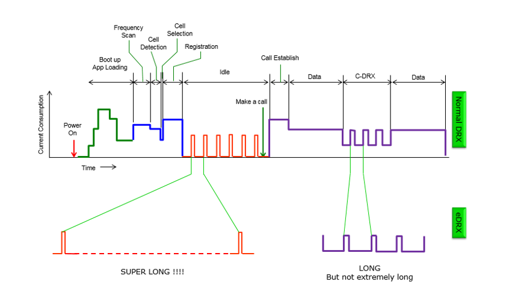
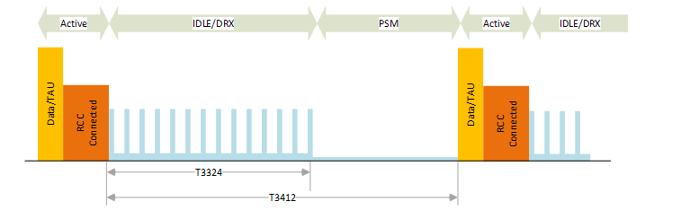
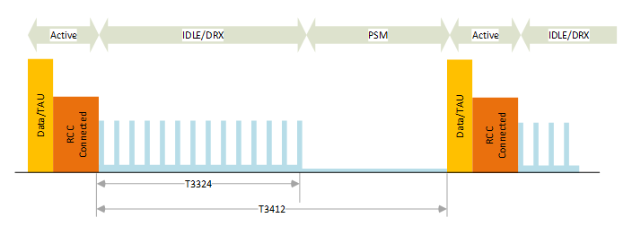

# Developer Guide

## Introduction

### About this Document

This document gives device and firmware developers an approach of LTE-M and NBIoT and its benefits in comparison with previous Cellular IoT technologies.

### General strategy
To attend requirements for IOT specific use cases, Telefonica has clearly betted to evolve its networks to licensed LPWA technologies, 
it means Telefonica is going to develop NB-IOT, and LTEM.

We include these new technologies as part of our value proposition including our current offer managed connectivity, security, QoS, private networks, etc.
Besides, Telefonica is going to develop end to end solutions; device, connectivity, data management, analytics, 
etc for some specific use cases to try to accelerate implementation of the customer service.

## Technological background

### Mobile IoT Technologies
Since the beginning of cellular communications, not only people have been connected using mobile phones, also machines have been connected to each other, 
what we call M2M, Machine-To-Machine communications. Currently, the term M2M has been replaced by IoT, 
to make clear the evolution that will have this type of technologies in the coming years, miniaturization of connected devices, 
massive increase in the number of connected equipment, increased coverage will be what will lead to the M2M a step further to the IoT. 

Typically the cheapest and simplest solution has been to use second generation 2G mobile technologies (GSM, GPRS, EDGE),
but when the throughput requirements were higher and the cost requirements were less demanding, 3G and 4G technologies were used too.

It is necessary to include cellular technologies in the use cases:
- Utilities: gas and water metering,
- Medical assisted living, remote monitoring
- Agriculture: Stationary tracking, environmental monitoring
- Industrial: machinery control, safety monitoring
- Consumer: wearables, pet tracking.
- Smart City: parking sensors, waste management

These use cases have specific requirements that force the emergence of new cellular technologies focused on the IoT:
- Wide area coverage: Covered by all mobile technologies.
- No access to the mains power: The devices will be battery powered in most cases.
- Low cost: The number of devices and applications will require a cost per device inside the current one.
- Strong propagation: Go one step further in coverage to enable IoT access to basements, rural environments, etc.

These four requirements are not met by current mobile technologies, 
which forced 3GPP to define two new standards based on the existing 4G infrastructure: NBIoT and LTE-M

Now launched commercially, the Mobile Internet of Things (Mobile IoT) is expanding rapidly with over 40 Commercial networks available globally, 
a combination of LTE-M and NB-IoT. Operating in licensed spectrum, low power wide area networks can provide low cost, yet secure, 
connectivity to battery-powered devices in both rural and urban locations. Following successful pilots involving a wide variety of use cases, 
Mobile IoT connectivity has now been deployed across Europe, North America and East Asia. 

### Selecting a technology: LTE-M vs NBIoT

!!!!!!!!!!!!!!!!!![logoss ]  ltem_logo.png

nb_logo.png

LTE-M extends LTE with features for improved support for Machine-Type Communications (MTC) and IoT.
The objective of LTE-M was to bring down the LTE device cost substantially to make LTE attractive for low end MTC applications that have so far been
adequately handled by GPRS. The cost reduction techniques were: reduced peak rate (1Mbps), single receive antenna, half duplex operation,
reduced bandwidth (1,4Mhz) and TX power (20dBm). 

NBIoT is designed for ultra-low-cost massive Machine-Type Communications, aiming to support a massive number of devices in a cell.
Low device complexity is one of the main design objectives, enabling module cost. Furthermore, it is designed to offer substantial coverage
improvements over GPRS as well as for enabling long battery lifetime. NBIoT has been designed to give maximal deployment flexibility.

|| LTE-M | NBIOT |
|:------ | ----- | ----- |
| BANDWIDTH | 1,4MHz | 200kHz |
| DL PEAK RATE | 300kbps HD | 50kbps |
|   | 1Mbps FD |  |
| UP PEAK RATE | 375kbps HD | 20kbps single tone |
|   | 1Mbps FD | 50 kbps multi tone |
| DUPLEX | HD (type B) or FD | HD (type B) or FD |
| LATENCY | 10-15ms | 1,4-10s |
| ANTENNAE | 1 | 1 |
| TRANSMIT POWER | 20dBm | 23dBm |
| MOBILITY  | Handover | Cell-Resellection |
| VOICE | Yes | No |

NBIoT is recommended when devices are massive and static. But when dealing with moving devices it is recommended to use a multi-technology 
NBIoT/LTE-M solution to avoid coverage issues and to guarantee the services.

## Functionalities for limited power consumption

There are a set of techniques that can be used in order to optimize the power consumption of the devices when using NBIoT and LTE-M. Some of them were added in previous 3GPP releases. Due to these functionalities the modules can save so much energy that some use cases are enabled. 

These functionalities are directly related with the status of the RRC link. AS you can see in the following figure there are four different status. RRC Connected, RRC Idle, PSM and Power Off.

!!!!!!! limited_power_consumption.png

A UE is in RRC_CONNECTED when an RRC connection is established. If no RRC connection is established the UE is in RRC_IDLE mode. When the device is in IDLE state, it is only listening to control channel broadcasts, such as paging notifications of inbound traffic, or connected, in which case the network has an established context and resource assignment for the client. When in RRC_IDLE, the device cannot send or receive any data. To do so, it must first synchronize itself to the network by listening to the network broadcasts and then issue a request to the RRC to be moved to the RRC_CONNECTED.
Once in a RRC_CONNECTED, a network context is established between the radio tower and the device, and data can be transferred. However, once either side completes the intended data transfer after a certain time of inactivity the device goes back to RRC_IDLE.

### RRC_IDLE
The radio is inactive but IP address is assigned and tracked by the network. UE is known in EPC but not known to eNB (LTE base station). The term "IDLE" gives an impression that UE is doing nothing in this state, but actually UE is quite busy in this state. Mobility is controlled by UE.
Device radio is in a low-power state and only listening to control traffic. No radio resources are assigned to the client within the carrier network.
Major procedures defined in IDLE mode:
- PLMN Selection: Detect PLMN of cells and identify the cell to clamp on.
- Cell Selection and Reselection : Performs neighboring cell measurement and do reselection 
- CSG cell selection and reselection
- Cell Reservations and Access Restrictions
- Tracking Area Registration
- Broadcast message reception: Acquire MIB and SIB
- Paging : Monitors the paging channel
- DRX reception

### RRC_CONNECTED
The radio is active and UE is known to both EPC and eNB. Device radio is in a high-power state while it either transmits data or waits for data, 
and dedicated radio resources are allocated by the radio network. Mobility is controlled by Network.
Major procedures defined in RRC_CONNECTED mode:
- Control Plane
  - eNB context and RRC connection
  - Network can transmit and/or receive data to/from UE
  - Neighbor cell measurement
- User Plane
  - UE can transmit and/or receive data to/from network
  - Monitors control signaling channel
  - Reports CQI and feedback information to eNB.
  - Connected Mode DRX

### DRX
The LTE modem supports the LTE DRX (3GPP LTE release 8) feature to enable short sleeps between data transmissions, and thus to minimize the UE power consumption. 
Two DRX modes are defined:
- DRX in LTE RRC_IDLE state: I-DRX
- DRX in LTE RRC_CONNECTED: C-DRX

### I-DRX
UE is said to be in RRC_IDLE mode when it is not connected to eNB, still the network keep track of the UE by paging mechanism. 
After the initial power-on sequence, the UE will perform limited functionality in IDLE mode hence saves lot of battery power. 
UE is paged for DL traffic but for UL traffic the UE will no longer be in IDLE state, it will move to the connected state.

!!!!!!  limited_power_consumption_idrx.png

In LTE, just as in most other modern wireless standards, there are shared uplink and downlink radio channels, the access to which is controlled by the RRC. 
When in a RRC_CONNECTED state, the RRC tells each and every device which timeslots are assigned to whom, which transmit power must be used, modulation, 
plus a dozen other variables.
If the mobile device does not have an assignment for these resources by the RRC, then it cannot transmit or receive any user data. 
Consequently, when in a DRX state, the device is synchronized to the RRC, but no uplink or downlink resources are allocated to it: the device is “half awake.”

!!!!!! limited_power_consumption_idrx_t.png

### C-DRX
This feature allow the UE to optimize its power consumption while active wait of incoming messages is being performed. 
It works in a similar way than I-DRX, but during the RRC_CONNECTED status, as showed in the following figures:

!!!!! limited_power_consumption_cdrx.png

In addition to I-DRX, LTE had RRC mode DRX as well also known as Connected Mode DRX (C-DRX), the purpose of both the DRX is same to conserve the battery power. 
During RRC connected state when there is no data transmission in either direction (UL/DL) UE goes into the DRX mode. 
It starts monitoring the PDCCH channel discontinuously in other words UE is in sleep and wake cycle.

!!!!!!!! limited_power_consumption_cdrx_t.png

Without the DRX the UE needs to monitor PDCCH in every subframe to check if there is downlink data available which drains the battery fast.

!!!!!!!!!!! limited_power_consumption_cdrx_t2.png

There are also three sub status when in RRC_CONNECTED:
- **Continuous reception** Highest power state, established network context, allocated network resources.
- **Short Discontinuous Reception (Short DRX)** Established network context, no allocated network resources.
- **Long Discontinuous Reception (Long DRX)** Established network context, no allocated network resources.

In the high-power state, the RRC creates a reservation for the device to receive and transmit data over the wireless interface and 
notifies the device for what these time-slots are, the transmit power that must be used, the modulation scheme, and a dozen other variables. 
Then, if the device has been idle for a configured period of time, it is transitioned to a Short DRX power state, where the network context is still maintained, 
but no specific radio resources are assigned. When in Short DRX state, the device only listens to periodic broadcasts from the network, 
which allows it to preserve the battery. This functionality is enabled by the network and it is automatically used by the UE, 
without any need of additional configuration.

### eDRX
There are largely two types of DRX in LTE. One is Idle mode DRX. This idle mode DRX is more commonly known as Paging Cycle which is explained in detail in Paging page. The other type is called C-DRX (Connected Mode DRX) which was described before.

eDRX is a mechanism that can extend the cycle (sleeping duration) of these two DRX (Idle mode DRX and C-DRX). The concept of eDRX can be illustrated as shown below.
This is intended to save energy (battery consumption). So eDRX would be mostly used in the application of IoT(Internet of Things) operating in energy saving mode.

	

The basic concept of eDRX would sound simple. Just extension of sleeping duration. So it can be implemented by adding a couple of large values Paging Cycle and DRX Cycle in RRC message. Both UE and eNB require a very accurate timer (clock) and the clock should be synchronized on both side. As you know, SFN (System Frame Number) and Subframe is the timer being used in current LTE for most of the synchronized operation. The maximum duration 
of SFN is 1024 radio frame meaning 10240 radio frame (around 10). However, eDRX cycle is designed to be much longer than this reaching several hours in case of Idle mode DRX. So we got to need another kind of timer (clock) that can measure much longer time duration. 

Extended Discontinuous Reception (eDRX) is an extension of an existing LTE feature, which can be used by IoT devices to reduce power consumption. eDRX can be used without PSM or in conjunction with PSM to obtain additional power savings.

Today, many smartphones use discontinuous reception (DRX) to extend battery life. By momentarily switching off the receive section of the radio module for a fraction of a second, the smartphone is able to save power. The smartphone cannot be contacted by the network whilst it is not listening, but if the period of time is kept to a brief moment, the smartphone user will not experience a noticeable degradation of service. For example, if called, the smartphone might simply ring a fraction of a second later than if DRX was not enabled.

eDRX allows the time interval during which a device is not listening to the network to be greatly extended. For an IoT application, it might be quite acceptable for the device to not be reachable for a few seconds or longer.

Whilst not providing the same levels of power reduction as PSM, for some applications eDRX may provide a good compromise between device reachability and power consumption. The maximum values are: 2621,44 (43min) seconds for LTE-M and 10485,76 seconds (174min) for NBIoT.

eDRX mode is controlled by three timers:
- **T3324 active timer:** It determines the duration during which the device remains reachable for mobile terminated transaction on transition from connected to idle mode. The device starts the active timer when it moves from connected to idle mode and when the active timer expires, the device moves to Power Saving Mode. This timer is controlled by the UE

	

- Paging window (PW): 
During this time the UE is listenting periodically for incoming packets. The length of this stage is controlled by the network. 
- eDRX cycle: 
This timer controls the duty cycle of the eDRX mode. This time can be configured by the UE, should be sized taking into account latency and reachability restrictions. This cycle is directly controlled by the UE.

Please refer to the “Timer Sumary” for further details.

!!!!!!!!!!  limited_power_consumption_edrx_t2.png

In the following figure the DRX mode is disabled, which means, that the UE does not enter PSM but it do perform TAU procedure periodically. 
A UE using PSM is available for mobile terminating services only for the period of an Active Time after a mobile originated event like data transfer or 
signaling for example after a periodic TAU/RAU procedure. The MME allows a value of '0' for the T3324 timer. In this case the UE enters 
the Power Saving Mode immediately.

### PSM
Power Saving Mode (PSM) is designed to help IoT devices conserve battery power and potentially achieve a 10-year battery life. When in PSM the device is not reachable, so it cannot send or receive any message from the network.
It is an especially kind of UE status that can minimize the energy consumption that is supposed to be even lower than normal idle mode energy consumption. 
This is newly added feature in Release 12 and is specified in 3GPP 24.301-5.3.11 Power saving mode and 23.682-4.5.4 UE Power Saving Mode. Similar to power-off, 
but the UE remains registered with the network. No need to re-attach or re-establish PDN connections. 
A UE in PSM is not immediately reachable for mobile terminating services.

!!!!!!!!!!!! limited_power_consumption_psm.png

Whilst it has always been possible for a device’s application to turn its radio module off to save battery power, the device would subsequently have to reattach to the network when the radio module was turned back on. The reattach procedure consumes a small amount of energy, but the cumulative energy consumption of reattaches can become significant over the lifetime of a device. Therefore, battery life could be extended if this procedure could be avoided.

When a device initiates PSM with the network, it provides two preferred timers (T3324 and T3412); PSM time is the difference between these timers (T3412-T3324). The UE asks the network with certain timer values, the network may accept these values or set different ones, in the case those values were out of bound. The network then retains state information and the device remains registered with the network. If a device awakes and sends data before the expiration of the time interval it agreed with the network, a reattach procedure is not required.

	

For example, for a monitoring application, the radio module in a device might be configured by an application to enable PSM, negotiate a 24-hour time interval with the network and provide a daily status update to a centralised monitoring point. If the device’s monitoring application were to detect an alarm condition, irrespective of any agreed sleep interval, the application could wake the radio module instantly and send vital information to the centralised monitoring point without the need to execute a reattach procedure.

However, in a similar manner to a radio the network cannot contact module that has been powered off, a radio module in PSM whilst it is asleep. The inability to be contacted whilst asleep may preclude the use of PSM for some applications.

Whilst the device is asleep, an operator might store incoming packets or SMS (if supported) to be forwarded to the device once it awakens. 
As is clear from the figure above, the value of the PSM is limited by the utilised tracking area update (TAU). During the attachment procedure, the device can also request a periodic TAU, also by providing a T3412 value.

## Release Assistance